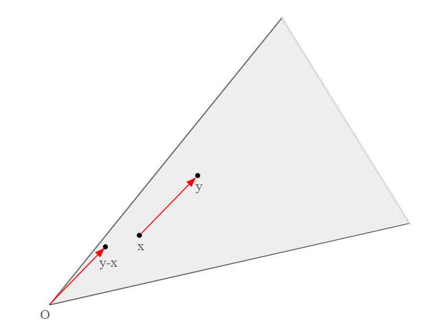
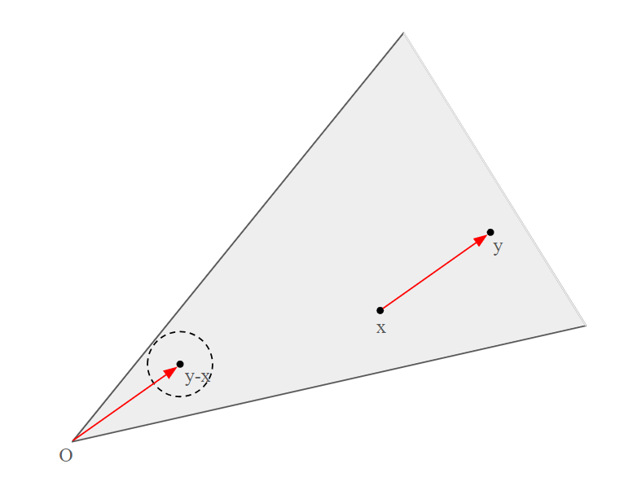
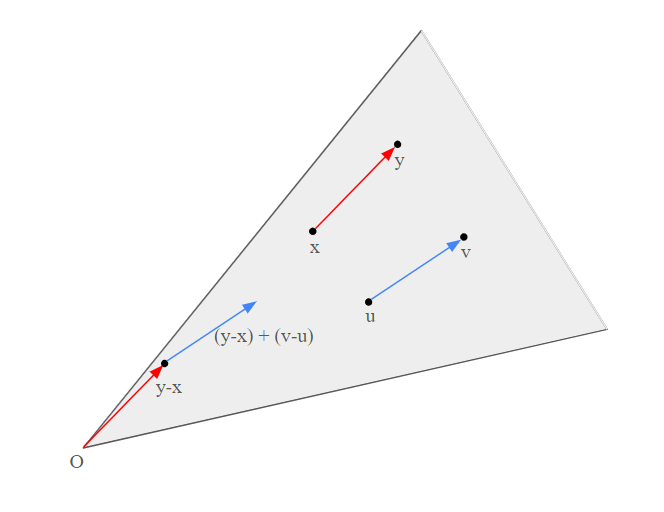
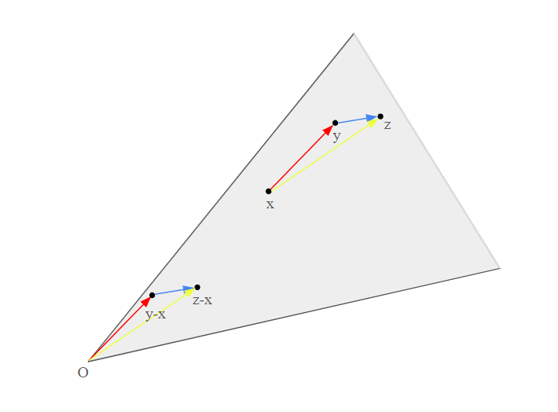
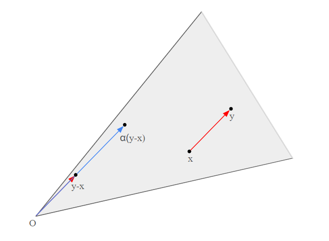
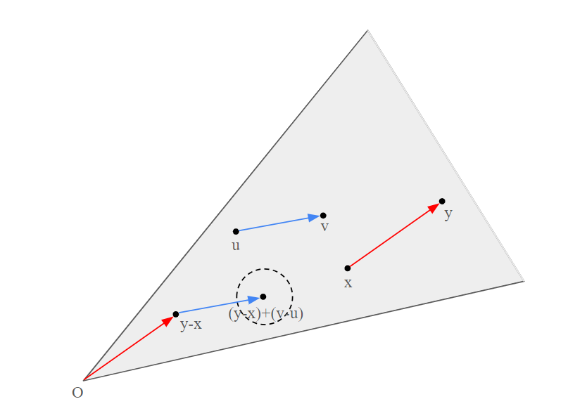
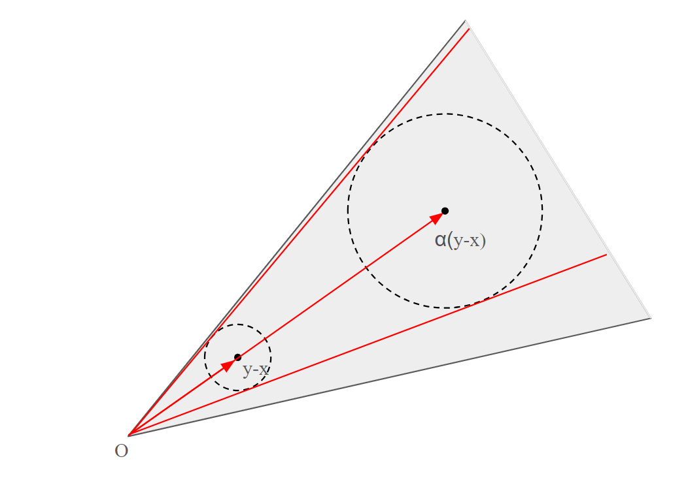
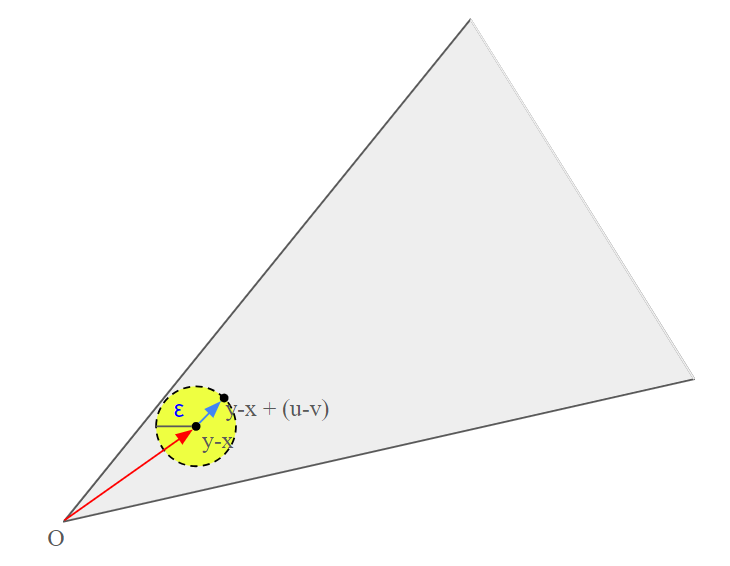

# 2.1 Affine and convex sets

## 2.1.1 Lines and line segments

**line** : Suppose $x_1 \neq x_2$ are two points in $\mathrm{R}^n$ Points of the form  
$$y = \theta x_1 + (1 - \theta) x_2$$
where $\theta \in \mathrm{R}$, form the ***line*** passing through $x_1$ and $x_2$. values of the parameter $\theta$ between 0 and 1 correspond to the (closed) ***line segment*** between $x_1$ and $x_2$.  
**direction** : $x_1 - x_2$  
**base point** : $x_2$

## 2.1.2 Affine sets

**affine** : A set $C \subseteq \mathrm{R}^n$ is ***affine*** if the line through any two distict points in $C$ lines in $C$  

**affine combination** : point of the form $\theta_1 x_1 + \cdots + \theta_kx_k$, where $\theta_1 + \cdots + \theta_k = 1$ is an ***affine combination*** of the points $x_1, \dots, x_k$  

**Proposition 2.1.2.1** Let $C \subseteq \mathrm{R}^n$ be affine, then the set $C - x_0$ is sub(vector)space of $\mathrm{R}^n$ for any $x_0 \in C$  

**Proof)**  Let $x_1, x_2$ be any points in $C - x_0$ then, there are two points $x_1', x_2'$ such that $x_1' - x_0, x_2' - x_1 \in C$. therefore, $\alpha x_1 + \beta x_2 = \alpha(x_1' - x_0) + \beta(x_2' - x_0) = \alpha x_1' + \beta x_2' + (1 - \alpha - \beta)x_0 - x_0$. Since $\alpha + \beta + (1-\alpha-\beta) = 0$ and $x_1', x_2', x_0 \in C$, $\alpha x_1' + \beta x_2' + (1 - \alpha - \beta)x_0 \in C$. thus $\alpha x_1 + \beta x_2 \in C - x_0$ for any $\alpha, \beta \in \mathrm{R}$

**dimension** : the ***demension*** of an affine set $C$ as the dimension of the subspace $V = C - x_0$, where $x_0$ is any elemen of $C$.

**affine hull** : The set of all affine combinations of points in some set $C \subseteq \mathrm{R}^n$ is called the ***affine hull*** of $C$, and denoted $\text{aff} \ C$

## 2.1.3 Affine dimension and relative interior

**affine dimension** : the ***affine dimension*** of a set $C$ is the dimension of its affine hull.

**relative interior** : the ***relative interior*** of the set $C$, denoted $\text{relint} \ C$, is its interior relative to $\text{aff} \ C$:

## 2.1.4 Convex sets
**convex** : A set $C$ is ***convex*** if the line segment between any two points in $C$ lies in $C$, i.e., if for any $x_1, x_2 \in C$ and any $\theta$ with $0 \leq \theta \leq 1$, we have 
$$ \theta x_1 (1-\theta)x_2 \in C$$

**convex combination** : We call a point of the form $\theta_1x_1 + \cdots + \theta_kx_k$, where $\theta_1 + \cdots + \theta_k = 1$ and $\theta_i \geq 0, i = 1, \dots, k$,a ***convex combination*** of the points $x_1, \dots, x_k$

**convex hull** : The ***convex hull*** of a set $C$, denoted $\text{conv}C$, is the set of all convex combinations of points in $C$:
$$\text{conv} C = \{\theta_1x_1 + \cdots + \theta_kx_k | x_i \in C, \theta_i \geq 0 i = 1, \dots, k, \theta_1 + \cdots + \theta_k = 1\} $$

## 2.1.5 Cones

**cone, nonnegative homogeneous** : A set $C$ is called a ***cone***, or ***nonnegative homogeneous***, if for every $x \in C$ and $\theta \geq 0$ we have $\theta x \in C$. 

**convex cone** : A set $C$ is a ***convex cone*** if it is convex and a cone, which means that for any $x_1, x_2$ and $\theta_1, \theta_2 \geq 0$, we have
$$ \theta_1 x_1 + \theta_2 x_2 \in C$$

**conic combination** : A point of the form $\theta_1x_1 + \cdots + \theta_kx_k$ with $\theta_1, \dots, \theta_k \geq 0$ is called a ***conic combination***

**conic hull** : The ***conic hull*** of a set $C$ is the set of all conic combinations of points in $C$, i.e.,
$$\{\theta_1x_1 + \cdots + \theta_kx_k | x_i \in C, \theta_i \geq 0, i = 1, \dots, k\}$$

# 2.2 Some important exmplaes

**affine** : $\empty$, $\{x_0\}$, $\mathbb{R}^n$, line, subspace  
**convex** : line segmenet, ***ray***, which has the form $\{x_0 +\theta v | \theta \geq 0\}$, where $v \neq 0$  
**convex cone** : line which through zero, ray which has base 0.

## 2.2.1 Hyperplanes and halfspaces

**hyperplane**: A ***hyperplane*** is a set of the form $$ \{x | a^Tx = b\} $$
where $a \in \mathbb{R}^n, a \neq 0$, and $b \in \mathbb{R}$

**two halfspaces** : A hyperplane divdes $\mathbb{R}^n$ into two ***halfspaces***. A (closed) half space is a set of the form 
$$ \{x | a^T x \leq b \} \ \ \ \ \text{or} \ \ \ \ \{x | a^T x \geq b \}$$ 
where $a \neq 0$

**ellipsoids** : $\mathcal{E} = \{x | (x - x_c)^T P^{-1} (x- x_c) \leq1 \}$

**norm cone** : $C = \{(x, t) | ||x|| \leq t \} \subseteq \mathbb{R}^{n+1}$

**polyhedron** : $$\mathcal{P} = \{x | Ax \preceq b, Cx = d\}$$

**affinely independent** : ***affinely independent*** means $v_1 - v_0, \dots, v_k - v_0$ are linearly independent.

**simplex** : $C = \text{conv}\{v_0, \dots, v_k\} = \{\theta_0 v_0 + \cdots + \theta_k v_k | \theta \succeq 0, \bold{1}^T\theta = 1\}$

**the set of symmetric $n \times n$ matrices:** $$\mathbb{S}^n = \{X \in X \in \mathbb{R}^{n\times n} | X = X^T \}$$
**the set of symmetric positive semidefinite matrices:** $$ \mathbb{S}^n_{+} = \{X \in \mathbb{S}^n | X \succeq 0\}$$
**the set of symmetric positive definite matrices:** $$ \mathbb{S}^n_{++} = \{X \in \mathbb{S}^n | X \succ 0\}$$

# Operations that preserve convexity

show that $C$ is obtained from simple convex sets (hyperplanes, halfspaces, norm balls, ...) by operations that preserve convexity

* intersection
* affine functions
* perspective function
* linear-fractional functions

## 2.3.1 Intersection

if $S_\alpha$ is convex for every $\alpha \in \mathcal{A}$, then $\cap_{\alpha \in \mathcal{A}} S_\alpha$ is convex 

(=the intersection of (any number of) convex sets is convex)

a closed convex set $S$ is the intersection of all halfspaces that contain it: 

$$S = \cap \{\mathcal{H} \vert \mathcal{H} \ \mathrm{halfspace}, S \subset \mathcal{H} \}$$

**example**

$$S = \left\{ x \in \mathbb{R}^m \mid |p(t)| \leq 1 \text{ for } |t| \leq \frac{\pi}{3} \right\},$$

where $p(t) = \sum_{k=1}^{m} x_k \cos kt = x_1 \cos t + x_2 \cos 2t + \cdots + x_m \cos mt$

$p(t)$는 row vector($\cos t, \cos 2t, ..., \cos mt$)와 column vector($x_1, x_2, ..., x_m$)의 곱이 된다.

$t$는 구간($\vert t \vert \leq \pi/3$)에서 막 바뀐다. 근데 바뀌더라도 $\vert p(t) \vert \leq 1$을 만족하는 $x$를 모두 모아놓은 집합이 $S$이다.

$m=2$일 경우

$$p(t)=x_1 \cos t + x_2 \cos 2t$$

figure 2.13 : $x_1, x_2$가 바뀜에 따라서 여러 가지 그림이 가능하다는 것을 보여주는 그림

$t$가 고정되었다고 생각하면 $\vert p(t) \vert$는 $\vert a^T x \vert \leq 1$ 형태를 띈다.

$a^Tx \leq 1 \ \mathrm{and} \ -a^Tx \leq 1$ 각각은 polyhedron이고 위는 밴드 모양을 띄운다.

$t$를 바꾸면 계수들이 살짝 바뀌면서 위 식에서 $a$값이 바뀌게 된다. 그러면 다른 모양의 밴드가 만들어 진다. 그렇게 모든 상황에 대한 교집합인 $S$가 만들어진다.

t를 고정했을 때 밴드가 된다 -> 이 밴드는 convex -> 아무리 많은(uncountably) intersection을 취해도 여전히 convex

## 2.3.2 Affine functions

**affine function** : a function $f : \mathbb{R}^n \rightarrow \mathbb{R}^m$ is ***affine*** if it is a sum of a linear function and a constant, i.e., if it has the form $f(x) = Ax + b$. where $A \in \mathbb{R}^{m \times n}$ and $b \in \mathbb{R}^m$

Let $f$ be affine

1. $f(S)=\{ f(x) \vert x \in S\}$ is convex for any convex set $S \subseteq \mathbb{R}^n$
2. $f^{-1}(S) = \{ x \vert f(x) \in S \}$ is convex for any convex set $S \subseteq \mathbb{R}^m$ 

**1. 증명**

$$
\begin{align*}
& y_1, y_2 \in f(S) \\
& y_1 = f(x_1), \ x_1 \in S \\
& y_2 = f(x_2), \ x_2 \in S  \\
& x = \theta x_1 + (1-\theta)x_2 \rightarrow x \in S \\
& \theta y_1 + (1-\theta) y_2 \in f(S), \  0 \leq \theta \leq 1 \\
& \theta f(x_1) + (1-\theta)f(x_2) \\
& = \theta Ax_1 + \theta b + (1-\theta)A x_2 + (1-\theta) b \\
& = A(\theta x_1 + (1-\theta)x_2) + b \in f(S) \\
& (\because x_1, x_2 \in S,\ S \text{ is convex, } 0 \leq \theta \leq 1)
\end{align*}
$$

**example**
* scaling : $f(x) = \alpha I x, \ \alpha I = A$
* translation : $f(x) = x + b$
* **projection** : The ***projection*** of a convex set onto some of its coordinates is convex: if $S \subseteq \mathbb{R}^m \times \mathbb{R}^n$ is covex, then
$$T = \{x_1 \in \mathbb{R}^m | (x_1, x_2) \in S \text{ for some }x_2 \in \mathbb{R}^n \}$$

is convex.

> Projection. Let $V$ be a vector space and $U \subseteq V$ a subspace of $V$. A linear mapping $\pi : V \rightarrow U$ is called a *projection* if $\pi^2 = \pi \circ \pi = \pi$  

* solution set of linear matrix inequality $\{ x \vert x_1A_1 + \cdots + x_mA_m \preceq B\}$ (with $A_i, B \in \mathbf{S}^p$)
  * $0 \preceq B - \sum A_i x_i$ 하게 만드는 $x$를 모아놓은 집합
  * LMI(linear Matrix Inequality), positive (semi)definite 식으로 inequality가 만들어지고 행렬들이 나오면 행렬들의 선형조합을 하는 그 계수들이 변수 $x$일 때 이 것을 LMI 라고 한다.
* hyperbolic cone $\{ x \vert x^TPx \leq (c^Tx)^2, c^Tx \geq 0\}$ (with $P \in \mathbf{S}_{+}^n$)

## 2.3.3 Linear-fractional and perspeective functions

**perspective function** : $P : \mathbf{R}^{n+1} \rightarrow \mathbf{R}^n$, with domain $\mathbf{dom} P = \mathbf{R}^n \times \mathbf{R}_{++}$, as $P(z, t) = z/t$

vector 를 $[x, t]^T \in \mathbf{R}^{n+1}$ ($x$ : column vector) 라고 할 때 맨 밑의 element $t$로 나누는 것. 그렇기 때문에 $\mathbf{R}_{++}$ 이 등장한 것이다.

the following hold:  
1. $P(C)$ is convex for any convex set $C \subset \mathbf{dom} P$ (images)
2. $P^{-1}(C)$ is convex for any convex set $C \subset \text{ran} P$ (inverse images)

**linear-fractional function** : $f : \mathbf{R}^n \rightarrow \mathbf{R}^m$

$$f(x)=\frac{Ax+b}{c^Tx+d}, \ \ \ \mathbf{dom}f=\{ x \vert c^Tx + d > 0 \}$$

images and inverse images of convex sets under linear-fractional functiosn are convex.

* $A \in \mathbf{R}^{m \times n}$
* $b \in \mathbf{R}^m$
* $c \in \mathbf{R}^n$
* $d \in \mathbf{R}$
* $c^Tx + d \in \mathbf{R}$ : scalar
  * 분모이므로 $\mathbf{dom}f=\{ x \vert c^Tx + d > 0 \}$
* $Ax + b \in \mathbf{R}^{m}$ : column vector

A **linear-fractional function** is formed by composing the perspective function with an affne function.

$$g(x) = \begin{bmatrix} A \\ c^T \end{bmatrix} x + \begin{bmatrix} b \\ d \end{bmatrix},$$

linear-fractional function $f$:

$$f(x) = P(g(x))$$

# 2.4 Generalized inequalities

**proper cone** : A cone $K \subseteq \mathbb{R}^n$ is called a ***proper cone*** if it satisfies the following:

* $K$ is convex
* $K$ is closed
* $K$ is ***solid***, which means it has nonempty interior.
* $K$ is ***pointed***, which means that it contains no line 

**examples**

* nonnegative orthant $K = \mathbf{R}_{+}^{n}=\{ x \in \mathbf{R}^n \vert x_i \geq 0, i = 1, ..., n \}$
* positive semidefinite cone $K = \mathbf{S}_{+}^n$
* nonnegative polynomials on $[0, 1]$:

$$K = \{x \in \mathbf{R}^n \mid x_1 + x_2 t + \cdots + x_n t^{n-1} \geq 0 \text{ for } t \in [0,1] \},$$

* 모든 $t \in [0, 1]$에 대해서 위 inequality를 만족하는 $x_1, x_2, ..., x_n$을 모아둔 column vector 집합을 $K$라 한다.
* 앞에 모두 $\theta$를 곱한다. 이 $\theta$에 음수를 넣으면 inequality가 깨진다. -> line을 포함하지 않는다.

**generalized inequalities**:

Let $K$ be proper cone, then the partial ordering on $\mathbb{R}^n$ defined by

$$x \preceq_K y \iff y - x \in K$$ 

$$ x \prec_K \iff y - x \in \mathbf{int}\ K$$

$$0 \preceq_K y \iff y \in K$$

$$
x \preceq_K y \iff y-x \in K \iff y \in x + K
$$
* $y$는 $x$로부터 뻗어나가는 cone에 속한다.

**partial ordering (↔ linear ordering)**

Real line $\mathbf{R}$에서 두 원소 $x, y$를 뽑으면 $x \leq y$ 아니면 $y \leq x$이다.(linear ordering) 하지만 generalized inequalities에서는 그 것이 성립하지 않는다.(partial ordering)

위와같이 $y \in x+K \iff x \preceq_K y$ 를 만족하지 않는다고 해서 (ex. $y_2$) $x \succeq_K y$를 만족하는 것이 아니다.

**examples**

* componentwise inequality ($K=\mathbf{R}_{+}^{n}$)
$$x \preceq_{\mathbf{R}_{+}^{n}} y \iff x_i \leq y_i, \ \ \  i = 1, ..., n$$

* matrix inequality ($K=\mathbf{S}_{+}^{n}$)

$$
\begin{align*}
X \preceq_{\mathbf{S}_{+}^{n}} Y &\iff Y-X \ \text{positive semidefinite} \\
&\iff Y - X \in \mathbf{S}_{+}^{n}
\end{align*}
$$

### Properties of generalized inequalities

- $\preceq_K$ is preserved under addition: if $x \preceq_K y$ and $u \preceq_K v$, then $x + u \preceq_K y+v$
 
- $\preceq_K$ is transitive:

- $\preceq_K$ is prserved under nonnegative scaling:

- $\preceq_K$ is reflecxive:
Since $K$ is cone, $x - x = 0 \in K$
- $\preceq_K$ is antisymmetric:
Suppose that $x \preceq_K y$ and $y \preceq_K x$ then, $y - x \in K, -(y-x) \in K$. Therefore, $x - y = 0$ since $K$ is solid 
- $\preceq_K$ is preserved under limits:
Since $K$ is closed
- if $x \prec_K y$ then $x \preceq_K y$
Since $\text{int} K \subseteq K$
- if $x \prec_K y$ and $u \preceq_K v$ then $x + u \prec_K y+v$

- if $x \prec_K y$ and $\alpha > 0$ then $\alpha x \prec_K \alpha y$
we can take radius $r < \epsilon \alpha$ if $B_\epsilon(x-y) \subset K$

- $x \nprec_K x$
Suppose that $x \prec_K x$ then $0 \in \text{int}K$ therefore there is $\epsilon$ such that $B_\epsilon(0) \in K$. Thus, we can take point $p$ such that $p \in K, -p \in K$ and $p \neq 0$. but it contradits the fact that $K$ is solid
- if $x \prec_K y$, then for $u$ and $v$ small enough, $x + u \prec_K y + v$
take $u$ and $b$ subject to $u, v < \epsilon / 2$

## 2.4.2 Minimum and minimal elements

$\preceq_K$ is not in general a linear ordering: we can have $x \cancel{\preceq}_K y$ and $y \cancel{\preceq}_K x$

**minimum** : $x \in S$ is the ***minimum*** element of $S$ (with respect to the generalized inequality $\preceq_K$) if for every $y \in S$ we have $x \preceq_K y$.

* $S$에 관한 모든 원소보다 $x$가 $K$라는 cone에 관해서 같거나 작으면 $x$를 minimum element라 한다.
* $S \subset x+K$
  * $x \preceq_K y$ : $x$에 $K$를 더한 것 안에 $y$가 속한다. 근데 $y \in S$이므로 위가 성립한다. 이때 $x$를 minimum element of $S$라 한다.
* unique

**minimal** : $x \in S$ is a ***minimal*** element of $S$ (with respect to the generalized inequality $\preceq_K$) if $y \in S, y \preceq_K x$ only if $y = x$.

A point $x \in S$ is the minimum element of $S$ if and only if 

$$S \subseteq \{y | x \preceq_K y\} = x+K$$

A point $x \in S$ is a minimal element if and only if
$$ x-K = \{y|y\preceq_Kx\} \cap S = \{x\}$$

* non-unique

**example** ($K=\mathbf{R}_{+}^{2}$)

* $K$는 nonnegative orthant
* left : $x_1$에 $K$를 더한 영역이 $S_1$이 포함되므로 $x_1$은 $S_1$의 minimum point
* right : 음영 구역을 $-K$라 생각하면 $(x-K) \cap S$ 는 $x_2$ 하나가 남는다. 이 점이 minimal point이다.
  * $x_2$ 에서 $K$ 방향으로 움직이면 어떤 $S_2$의 원소가 있어서 $K$ 방향으로는 $x_2$가 제일 작다. $K$ 방향이 아닌 것들과는 비교하지 않는다.(ordering이 성립하지 않으므로)
* minimum은 $S$에 속하는 모든 원소에 대해 ordering이 성립하고 제일 작아야 하고, minimal은 ordering이 성립하는 것들 중에서 제일 작으면 minimal
<!-- TODO : 위 내용은 애매하므로 나중에 수정 필요함 -->

## 2.5 Separating and suppoting hyperplanes

### 2.5.1 Separating hyperplane theorem

#### Seprating hyperplane theorem

Suppose $C$ and $D$ are  nonempty disjoint convex sets, i.e., $C \cap D = \empty$. Then there exist $a \neq 0$ and $b$ such that $a^Tx \leq b$ for all $x \in C$ and $a^Tx \geq b$ for all $x \in D$.

차수가 하나 낮은 걸로 둘로 가를 수 있다.

역 : 어떤 separating hyperplane이 존재하면 $C, D$는 disjoint 하고 convex 한가? -> False

$\varepsilon$

* 반례 : $C = D = {0}$, $C, D$는 convex하고 disjoint하지 않지만 무수히 많은 separating hyperplane이 존재한다.

If $C$ : open, then existence of separating hyperplane -> $C \cap D = \phi$ ($C, D$중 하나가 open 일 때 hyperplane이 존재하는 것이 $C$와 $D$가 disjoint하는 것을 의미하는가?)

$f(x)=a^Tx-b=0$으로 hyperplane이 되는 $f(x)$를 잡았을 때 $f(x) \leq 0 \text{ on } C$, $f(x) \geq 0 \text{ on } D$이면 이것이 hyperplane이 될 것이다.

여기서 $C$ 가 open이면 $f(x) < 0 \text{ on }C$ 로 등호가 빠지는 것을 보이면 증명이 끝난다. 왜냐하면 $D$에서는 0보다 크거나 같고 $C$에서는 0보다 작으니까 C와 D에서는 공유하는 원소가 하나도 없다

**증명**

만약 $f(x) < \text{ on } C$ 가 성립하지 않는다면 $f(x^{*})=0$ 를 만족하는 $x^{*}$가 $C$에 존재한다. 그런데 이 $f$는 affine function이고 $C$는 open이므로 $x^{*}$를 약간 perturbation해도 $C$에 속하게 할 수 있다.

$x^{*}$를 약간 perturbation 했을 때 $a^T$ 방향(normal vector 방향)으로 perturbation하면

$$f(x^{*} + \delta) > 0, \ \ x^{*} + \delta \in C$$

가 되도로 할 수 있다. 이것은 $f(x) \leq 0$에 모순이다.

**strict separation** : if the hyperplane satisfies the stronger condition that $a^Tx < b$ for all $x \in C$ and $a^Tx > b$ for all $x \in D$, This is called ***strict separation*** of the sets $C$ and $D$.

strict separation requires additional assumptions (e.g. $C$ is closed, $D$ is a singleton)

예를 들어 $C$가 closed, convex이고 $D$가 singleton $\{ x_0 \}$ 이고 $C, D$가 disjoint하면 strict seperation 하는 hyperplane이 존재한다

그렇다면 $C, D$가 closed convex이고 disjoint하면 strict separating hyperplane이 존재할까? -> False

반례

### Converse separating hyperplane theorems

**Claim)** suppose $C$ and $D$ are convex sets, with $C$ open, and there exists an affine function $f$ that is nonpositive on $C$ and nonnegative on $D$. Then $C$ and $D$ are disjoint

**Theorem** any two convex sets $C$ and $D$, at least one of which is open, are disjoint if and only if there exists a separating hyperplane.

## 2.5.2 Supporting hyperplanes

**supporting hyperplanes** : Suppose $C \subseteq \mathbb{R^n}$, and $x_0$ is a point in its boundary. If $a\neq 0$ satisfies $a^Tx \leq a^Tx_0$ for all $x \in C$, then the hyperplane $\{x | a^Tx = a^Tx_0\}$ is called a ***supporting hyperplane*** to $C$ at the point $x_0$.

hyperplane(affine set)의 한쪽 면에 $C$가 온전히 들어갈 수 있으면 해당 plane을 supporting hyperplane이라고 한다. separating hyperplane은 붙어도 되고 떨어져도 되는데 supporting hyperplane은 붙어있어야 한다.

한 점에 대해 supporting hyperplane이 여러개일 수도 있다.

### Supporting hyperplane theorem

for any nonempty convex set $C$, and any $x_0 \in \mathbf{bd} \ C$, there exists a supporting hyperplane to $C$ at $x_0$

**증명**

$\mathbf{int} \ C$가 공집합이라 하면 $\mathbf{R}^n$ 공간에서 적어도 $C$는 그것보다 한 차수 낮아야 한다. 그런데 $C$가 convex하므로 $C$를 포함하는 Affine set $A$를 잡을 수 있다. $C \subset A$, 납작하다는 뜻이다. $\mathbf{R}^n$ 공간에서 $C$는 interior가 없으니까 평면처럼 납작한 상태이다. 해당 평면의 모양은 convex일 것이다. 그렇다면 해당 affine set $A$가 supporting hyperplane이다. boundary에 있고 $C$를 온전히 포함한다.

$\mathbf{int} \ C$가 공집합이 아니라면

$\mathbf{int} \ C$ 와 $\{ x_0 \}$ 는 disjoint하고 $\mathbf{int} \ C$ 는 open convex set이고 $\{ x_0 \}$는 closed convex set이다. 그렇다면 separating hyperplane이 존재하는데 그것이 바로 support hyperplane이다.

### Partial converse of the supporting hyperplane theorem

If a set is closed, has nonempty interior, and has a supporting hyerplane at every point in its boundary, then it is convex.

# Dual cones and generalized inequalities

## 2.6.1 Dual cones

Let $K$ be a cone. The set
$$K^* = \{y | x^Ty \geq 0 \text{ for all } x \in K\} $$
is called the ***dual cone*** of $K$.

$K$라는 cone에 들어가는 모든 원소 $x$에 대해 inner product를 했을 때 0보다 같거나 큰 $y$를 모아둔 집합을 dual cone이라 한다.

$K$가 not convex라 해도 dual cone $K^{*}$는 convex이다.

$x^T y \geq \mathrm{const}, \forall x \in K \rightarrow x^T y \geq 0, \forall x \in K$

$\mathrm{const}=-C, \ C > 0$이라면 $x^T y \geq -C$라는 의미가 된다. cone의 성질에 따라 임의의 양수 $\alpha$에 대해 $x \in K$이면 $\alpha x \in K$가 된다. 따라서 $x^T y \geq -C$는 $\alpha x \in K$에 대해서도 성립해야 한다. $\alpha (x^T y) \geq -C$ 에서 $\alpha$를 매우 크게 만들때 만약 $x^Ty$가 음수라면 매우 큰 음수가 되어 $-C$보다 크지 않기 때문에 만족하지 못하게 된다. 따라서 $x^Ty \geq 0$이 되어야 한다. 

$K$가 cone이면 $x$에 어떤 작은 수를 곱해도 $x^T y \geq \mathrm{const}$가 성립해야 한다.

**examples**

* $V$ : subspace in $R^n$, $V^{*} = V^{\perp}$
* $K = \mathbf{R}_{+}^{n}: \ K^{*} = \mathbf{R}_{+}^{n}$
* $K = \mathbf{S}_{+}^{n}: \ K^{*} = \mathbf{S}_{+}^{n}$
* $K=\{ (x,t) \vert \| x \|_2 \leq t \}: \  K^{*}=\{ (x,t) \vert \| x \|_2 \leq t \}$
* $K=\{ (x,t) \vert \| x \|_1 \leq t \}: \  K^{*}=\{ (x,t) \vert \| x \|_\infty \leq t \}$

**증명**

$$K = \mathbf{R}_{+}^{n}: \ K^{*} = \mathbf{R}_{+}^{n}$$

$x^Ty \geq 0, \ \forall x \succeq 0 \iff y \succeq 0$ 를 보이면 된다. $\forall x \succeq 0$ $K$에 속하는 모든 $x$에 대해서 내적을 취하면 0보다 크거나 같은 $y$는 모두 0보다 크거나 같다.

만약 $y$의 벡터중 어떤 원소가 0보다 작다면 그 원소와 내적하는 $x$값을 매우 높이면 $x^Ty \geq 0$이 깨지게 될 것이다. 따라서 $y \succeq 0$이 될 수밖에 없다.

$$K = \mathbf{S}_{+}^{n}: \ K^{*} = \mathbf{S}_{+}^{n}$$

$X, Y \in \mathbf{S}_{+}^{n}$, 일때 내적은 $\mathbf{tr}(XY)$이다(정의).

$\mathbf{tr}(XY) = \sum_{i,j=1}^n X_{ij} Y_{ij}$

$\mathbf{tr}(XY) \geq 0, \ \  \forall X \succeq 0 \iff Y \succeq 0$ 을 보이면 된다.

$(\Rightarrow)$ If $Y \notin \mathbf{S}_{+}^{n}, \ \exist q \text{ such that } q^TYq < 0$ 일 때 $\mathbf{tr}(XY)=\mathbf{tr}(YX)$이므로 $\mathbf{tr}(q^TYq)=\mathbf{tr}(qq^TY)$, $qq^T$를 $X \in  \mathbf{S}_{+}^{n}$로 보면 $\mathbf{tr}(XY) < 0$ 이 된다. 이는 모순이다.

$(\Leftarrow)$ Let $Y \succeq 0 \text{ and } X \succeq 0$ 여기서 $X=\sum_{i=1}^n \lambda_i q_i q_i^T$

$\mathbf{tr}(YX) = \mathbf{tr}(Y\sum \lambda_i q_i q_i^T) = \sum \lambda_i q_i^T Y q_i$

$q_i^T Y q_i$가 scalar이므로 trace밖으로 나온다. $X$가 semidefinite 행렬이므로 $\lambda_i \geq 0$이다. 또한 $Y$ 도 semidefinite이므로 $\sum \lambda_i q_i^T Y q_i \geq 0$

임의의 $Y, X$를 잡았을 때 $\mathbf{tr}(XY) \geq 0$ 을 만족시킴을 보임

**Nonnegative orthant** : The cone $\mathbb{R}^n_+$ is its own dual:
$$ x^Ty \geq 0 \text{ for all } x \succeq 0 \iff y \succeq 0.$$
We call such a cone ***self-dual***

## A.1.6 Dual norm

$$\|z\|_{\ast} = \sup \{ z^T x \mid \|x\| \leq 1 \}.$$

* $z^T x=z^T\frac{x}{\|x\|} \|x\| \leq \|z\|_{\ast} \|x\|$
* $\|x\| \leq 1 \rightarrow z^T\frac{x}{\|x\|} \leq \|z\|_{\ast}$
* $\text{tight} \leq$ : $z^T x\leq \|z\|_{\ast} \|x\|$ 에서 $=$ 를 만족하는 원소가 있다.

1. $\| \cdot \|_{2 \ast} = \| \cdot \|_2 (=\sqrt{x^Tx})$
   * $(\because) \ \ \| z \|_{2 \ast} = \sup \{ z^Tx : \| x \|_2 \leq 1 \} = z^T \frac{z}{\| z \|_2} = \| z \|_2$
   * $z$랑 같은방향의 $x$
2. $\| \cdot \|_{\infty \ast} = \| \cdot \|_{1}$
   * $(\because) \| z \|_{\infty \ast} = \sup \{ z^Tx : \| x \|_{\infty} = 1 \}$
   * $\| x \|_{\infty} = \max_i \vert x_i \vert$
   * $z^Tx = z_1x_1 + z_2x_2 + \cdots + z_nx_n$ 에서 $z_i$가 음수면 $x_i=-1$, $z_i$가 양수면 $x_i=1$ ($\because \| x \|_{\infty} = 1$)로 계산하면 $\vert z_1 \vert + \vert z_2 \vert + \cdots \vert z_n \vert = \sum_i \vert z_i \vert$
3. $\| \cdot \|_{1 \ast} = \| \cdot \|_{\infty}$

---

### Ex 2.25, Dual of norm cone

**norm cone**
$$K = \{ (x, t) \mid \|x\| \leq t \} \subseteq \mathbb{R}^{n+1}.$$

**Dual of norm cone**
$$K^{\ast} = \{ (u, v) \in \mathbb{R}^{n+1} \mid \|u\|_{\ast} \leq v \}$$

* Dual of norm cone은 dual norm을 써서 norm cone의 공식 그대로 적으면 된다.

**증명**

$x^Tu + tv \geq 0 \text{ whenever } \| x \| \leq t \iff \| u \|_{*} \leq v.$

$(\Leftarrow) \text{ Let } \| u \|_{*} \leq z, \text{ Pick any } \| x \| \leq t$

$t=0 \rightarrow \| x \| = 0 \rightarrow x^Tu + tv \geq 0$

$t > 0 \rightarrow \| - \frac{x}{t} \| \leq 1$

$u^T\left( - x/t\right) \leq \| u \|_{*} \leq v$

(dual norm : $\|z\|_{\ast} = \sup \{ z^T x \mid \|x\| \leq 1 \}.$)

$\therefore u^Tx + vt \geq 0$

$(\Rightarrow)$ Suppose $\| u \|_{*} > v \rightarrow \exist x \text{ such that } \| x \| \leq 1, x^Tu > v$

$x^Tu > v \cdot 1$ 이라고 생각해보면 $-x^Tu + v \cdot 1 < 0$이 된다.

이때 $x^Tu + tv \geq 0$에 $(x,t) = (-x,1)$ 를 대입하면 이는 $\|x\| \leq t$를 만족하므로 $K = \{ (x, t) \mid \|x\| \leq t \} \subseteq \mathbb{R}^{n+1}.$에 속하는데 결과로 $-x^Tu + t \cdot 1 \geq 0$와 모순이다.

---

Dual cones satisfy several properties, such as:

* $K^*$ is closed and convex ($K$ may not be)
* $K_1 \subseteq K_2$ implies $K^*_2 \subseteq K_1^*$
  * 직관) 더 많은 것들에 대해 내적이 0 이상임을 만족해야 하므로 콘이 커질수록 dual cone은 작아진다.
* If $K$ has nonempty interior, then $K^*$ is pointed
* If the closure of $K$ is pointed then $K^*$ has nonempty interior.
* $K^{\ast \ast}$ is the closure of the convex hull of $K$. (Hence if $K$ is convex and closed, $K^{\ast \ast} = K$.)

These poperties show that if $K$ is a proper cone, then so is its dual $K^*$, and moreover, that $K^{\ast \ast} = K$.

## 2.6.2 Dual generalized inequalities

suppose that the convex cone $K$ is proper.

* $x \preceq_K y$ if and only if $\lambda^T x \leq \lambda^T y$ for all $\lambda \succeq_{K^*}0$
  * $x \preceq_K y \iff y-x \in K$
  * $\lambda \succeq_{K^*}0 \iff \lambda \in K^{*}$
  * dual cone에 속하는 모든 $\lambda$라는 벡터에 대해서 $\lambda^T x \leq \lambda^T y$와 같이 변형(weighting)을 취하고 나면 inequality가 성립한다.
* $x \preceq_K y$ if and only if $\lambda^T x < \lambda^T y$ for all $\lambda \succeq_{K^*}0, \lambda \neq 0$

**증명**

$x \preceq_K y$ if and only if $\lambda^T x \leq \lambda^T y$ for all $\lambda \succeq_{K^*}0$

proper cone $K$와 $K^{\ast}$가 있다면

Pick any $x, y$ such that $x \leq_K y (y-x \in K)$ and pick any $\lambda \in K^{\ast}\ (0 \leq_{K{\ast}} \lambda)$ then $\lambda^T(y-x) \geq 0$

$\lambda^Tx \leq \lambda^Ty$

dual cone의 정의, 즉 $K$에 속하는 벡터와 그 dual에 속하는 벡터는 내적을 취하면 0보다 작거나 크다

### Theorem of alternatives for linear strict generalized inequalities

Suppose $K \subseteq \mathbb{R}^m$ is a proper cone. Consider the strict generalized inequality
$$ Ax \preceq_K b$$
where $x \in \mathbb{R}^n$ **if and only if** there exists $\lambda$ such that
$$ \lambda \neq 0, \quad \lambda \succeq_{K^*} 0, \quad A^T\lambda = 0, \quad \lambda^Tb \leq 0$$

## 2.6.3 Minimum and minimal elements via dual inequalities

### Dual characterization of minimum elements

> **minimum** : $x \in S$ is the ***minimum*** element of $S$ (with respect to the generalized inequality $\preceq_K$) if for every $y \in S$ we have $x \preceq_K y$.

$x$ is the minimum element of $S$, with respect to the generalized inequality $\preceq_K$, if and only if for all $\lambda \succ_{K^*} 0$, $x$ is the unique minimizer of $\lambda^Tz$ over $z \in S$.

minimum관계식에서는 $K$에 관한 inequality, set에 의한 포함관계였는데 ($x \preceq_K y \iff y-x \in K$) $\lambda^Tz$와 같이 scalar값으로 편하게 다룰 수 있게 된다.

**증명**

$(\Rightarrow) x \preceq_K z, \forall z \in S$ pick any $\lambda$ such that $\lambda \succ_{K^{\ast}}0$ ($x$ is minimum element : $x \preceq_K z, \forall z \in S$)

Then $\lambda^T (z-x) > 0$

$z - x \in K (\because x \succeq_K z)$, $\lambda$는 그것의 dual cone에 속한다. $(\because \lambda >_{K^{\ast}}0)$ 내적을 취하면 0보다 크거나 같아야 하지만 $\lambda \succ_{K^{\ast}}0$ 에서 등호가 없으므로 $\lambda^T (z-x) > 0$

따라서 $\lambda^Tz > \lambda^Tx$

$(\Leftarrow)$ Let $\lambda \succ_{K^{*}}0$ and $\lambda^Tx < \lambda^T z, \forall z \in S$

Suppose $\exist z \in S \text{ such that } x\cancel{\preceq}_K z (\iff z - x \notin K)$

Then $\exist \bar{\lambda} \succeq_{K^{\ast}}0 \text{ such that } \bar{\lambda}^T(z-x) < 0$

Then $\exist \lambda \succ_{K^{\ast}} 0 \text{ such that } \lambda^T(z-x) < 0$ 이는 모순이다.

### Dual characterization of minimal elements

> **minimal** : $x \in S$ is a ***minimal*** element of $S$ (with respect to the generalized inequality $\preceq_K$) if $y \in S, y \preceq_K x$ only if $y = x$.

* If $\lambda \succ_{K^*}0$ and $x$ minimizes $\lambda^Tz$ over $z \in S$, then $x$ is minimal.

$\lambda_1$ 방향의 가장 끝 반대방향으로 접하는 점이 $\lambda_1$에 대해서는 minimal point를 준다.

만약 $\lambda \succ_{K^*}0$이 아니라 $\lambda \succeq_{K^*}0$ 라면 위 공간의 파란 부분이 모두 minimal point가 되는데 이것은 말이 안된다. $x_3$만이 minimal point이다. 따라서 등호가 없는 $\lambda \succ_{K^*}0$ 조건을 가진다.

**증명**

Let $\lambda \succ_{K^{\ast}}0 \text{ such that } \lambda^T(z-x) > 0, \  \forall z \in S$

$K^{\ast}$에 $\lambda$ 가 존재해서 $\lambda^Tz$를 $S$에 대해서 minimize하고 있다

suppose $x$ not minimal. ($\exist z \in S, z \neq x, z \preceq_K x$) 를 만족하는 $z$가 존재한다. $x$가 minimal이 아니라는 말은 어떤 $S$에 $z$가 존재하긴 하지만 $x-z$가 $K$에 속하면서 $x$와 $z$가 같지 않다.

$S$에 속하는 $z$를 잡았는데 $z \preceq_K x$ 관계가 성립한다고 하면 $z$가 $K$에 대해 더 작다는 뜻이다. $S$에 대한 모든 원소 $z$가 $z \preceq_K x$를 만족할 필요는 없지만 만약 $z$가 $S$에 존재해서 $z \preceq_K x$ 관계가 성립한다고 하면 적어도 $x$는 minimal point이므로 $z$보다 작거나 같아야 한다. 그런데 $z \preceq_K x$가 성립한다고 하면 $z$는 $x$와 같아야 한다. 근데 같지 않다고 말한다.

-> $x-z$는 $K$에 속하고 $\lambda$는 $K^{\ast}$에 속하므로 내적 취하면 $\lambda^T(x-z) > 0$ 이다. 이것은 $\lambda^T(z-x) > 0$ 가정을 위배한다.

> If $\lambda \succ_{K^*}0$ and $x$ minimizes $\lambda^Tz$ over $z \in S$, then $x$ is minimal.

위 조건에 convex set 조건을 추가하면 역이 성립한다.

* if $x$ is minimal element of a convex set $S$, then there exists a nonzero $\lambda \succeq_{K^{\ast}}0$ such that $x$ minimizes $\lambda^Tz$ over $S$

**증명**

$(x-k) $