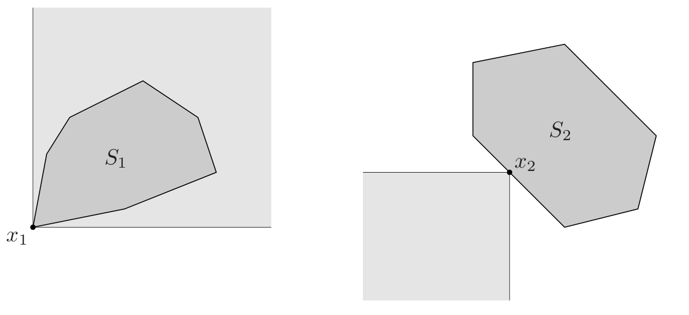

# 2.1 Affine and convex sets

## 2.1.1 Lines and line segments

**line** : Suppose $x_1 \neq x_2$ are two points in $\mathrm{R}^n$ Points of the form  
$$y = \theta x_1 + (1 - \theta) x_2$$
where $\theta \in \mathrm{R}$, form the ***line*** passing through $x_1$ and $x_2$. values of the parameter $\theta$ between 0 and 1 correspond to the (closed) ***line segment*** between $x_1$ and $x_2$.  
**direction** : $x_1 - x_2$  
**base point** : $x_2$

## 2.1.2 Affine sets

**affine** : A set $C \subseteq \mathrm{R}^n$ is ***affine*** if the line through any two distict points in $C$ lines in $C$  

**affine combination** : point of the form $\theta_1 x_1 + \cdots + \theta_kx_k$, where $\theta_1 + \cdots + \theta_k = 1$ is an ***affine combination*** of the points $x_1, \dots, x_k$  

**Proposition 2.1.2.1** Let $C \subseteq \mathrm{R}^n$ be affine, then the set $C - x_0$ is sub(vector)space of $\mathrm{R}^n$ for any $x_0 \in C$  

**Proof)**  Let $x_1, x_2$ be any points in $C - x_0$ then, there are two points $x_1', x_2'$ such that $x_1' - x_0, x_2' - x_1 \in C$. therefore, $\alpha x_1 + \beta x_2 = \alpha(x_1' - x_0) + \beta(x_2' - x_0) = \alpha x_1' + \beta x_2' + (1 - \alpha - \beta)x_0 - x_0$. Since $\alpha + \beta + (1-\alpha-\beta) = 0$ and $x_1', x_2', x_0 \in C$, $\alpha x_1' + \beta x_2' + (1 - \alpha - \beta)x_0 \in C$. thus $\alpha x_1 + \beta x_2 \in C - x_0$ for any $\alpha, \beta \in \mathrm{R}$

**dimension** : the ***demension*** of an affine set $C$ as the dimension of the subspace $V = C - x_0$, where $x_0$ is any elemen of $C$.

**affine hull** : The set of all affine combinations of points in some set $C \subseteq \mathrm{R}^n$ is called the ***affine hull*** of $C$, and denoted $\text{aff} \ C$

## 2.1.3 Affine dimension and relative interior

**affine dimension** : the ***affine dimension*** of a set $C$ is the dimension of its affine hull.

**relative interior** : the ***relative interior*** of the set $C$, denoted $\text{relint} \ C$, is its interior relative to $\text{aff} \ C$:

## 2.1.4 Convex sets
**convex** : A set $C$ is ***convex*** if the line segment between any two points in $C$ lies in $C$, i.e., if for any $x_1, x_2 \in C$ and any $\theta$ with $0 \leq \theta \leq 1$, we have 
$$ \theta x_1 (1-\theta)x_2 \in C$$

**convex combination** : We call a point of the form $\theta_1x_1 + \cdots + \theta_kx_k$, where $\theta_1 + \cdots + \theta_k = 1$ and $\theta_i \geq 0, i = 1, \dots, k$,a ***convex combination*** of the points $x_1, \dots, x_k$

**convex hull** : The ***convex hull*** of a set $C$, denoted $\text{conv}C$, is the set of all convex combinations of points in $C$:
$$\text{conv} C = \{\theta_1x_1 + \cdots + \theta_kx_k | x_i \in C, \theta_i \geq 0 i = 1, \dots, k, \theta_1 + \cdots + \theta_k = 1\} $$

## 2.1.5 Cones

**cone, nonnegative homogeneous** : A set $C$ is called a ***cone***, or ***nonnegative homogeneous***, if for every $x \in C$ and $\theta \geq 0$ we have $\theta x \in C$. 

**convex cone** : A set $C$ is a ***convex cone*** if it is convex and a cone, which means that for any $x_1, x_2$ and $\theta_1, \theta_2 \geq 0$, we have
$$ \theta_1 x_1 + \theta_2 x_2 \in C$$

**conic combination** : A point of the form $\theta_1x_1 + \cdots + \theta_kx_k$ with $\theta_1, \dots, \theta_k \geq 0$ is called a ***conic combination***

**conic hull** : The ***conic hull*** of a set $C$ is the set of all conic combinations of points in $C$, i.e.,
$$\{\theta_1x_1 + \cdots + \theta_kx_k | x_i \in C, \theta_i \geq 0, i = 1, \dots, k\}$$

# 2.2 Some important exmplaes

**affine** : $\empty$, $\{x_0\}$, $\mathbb{R}^n$, line, subspace  
**convex** : line segmenet, ***ray***, which has the form $\{x_0 +\theta v | \theta \geq 0\}$, where $v \neq 0$  
**convex cone** : line which through zero, ray which has base 0.

## 2.2.1 Hyperplanes and halfspaces

**hyperplane**: A ***hyperplane*** is a set of the form $$ \{x | a^Tx = b\} $$
where $a \in \mathbb{R}^n, a \neq 0$, and $b \in \mathbb{R}$

**two halfspaces** : A hyperplane divdes $\mathbb{R}^n$ into two ***halfspaces***. A (closed) half space is a set of the form 
$$ \{x | a^T x \leq b \} \ \ \ \ \text{or} \ \ \ \ \{x | a^T x \geq b \}$$ 
where $a \neq 0$

**ellipsoids** : $\mathcal{E} = \{x | (x - x_c)^T P^{-1} (x- x_c) \leq1 \}$

**norm cone** : $C = \{(x, t) | ||x|| \leq t \} \subseteq \mathbb{R}^{n+1}$

**polyhedron** : $$\mathcal{P} = \{x | Ax \preceq b, Cx = d\}$$

**affinely independent** : ***affinely independent*** means $v_1 - v_0, \dots, v_k - v_0$ are linearly independent.

**simplex** : $C = \text{conv}\{v_0, \dots, v_k\} = \{\theta_0 v_0 + \cdots + \theta_k v_k | \theta \succeq 0, \bold{1}^T\theta = 1\}$

**the set of symmetric $n \times n$ matrices:** $$\mathbb{S}^n = \{X \in X \in \mathbb{R}^{n\times n} | X = X^T \}$$
**the set of symmetric positive semidefinite matrices:** $$ \mathbb{S}^n_{+} = \{X \in \mathbb{S}^n | X \succeq 0\}$$
**the set of symmetric positive definite matrices:** $$ \mathbb{S}^n_{++} = \{X \in \mathbb{S}^n | X \succ 0\}$$

# Operations that preserve convexity

show that $C$ is obtained from simple convex sets (hyperplanes, halfspaces, norm balls, ...) by operations that preserve convexity

* intersection
* affine functions
* perspective function
* linear-fractional functions

## 2.3.1 Intersection

if $S_\alpha$ is convex for every $\alpha \in \mathcal{A}$, then $\cap_{\alpha \in \mathcal{A}} S_\alpha$ is convex 

(=the intersection of (any number of) convex sets is convex)

a closed convex set $S$ is the intersection of all halfspaces that contain it: 

$$S = \cap \{\mathcal{H} \vert \mathcal{H} \ \mathrm{halfspace}, S \subset \mathcal{H} \}$$

**example**

$$S = \left\{ x \in \mathbb{R}^m \mid |p(t)| \leq 1 \text{ for } |t| \leq \frac{\pi}{3} \right\},$$

where $p(t) = \sum_{k=1}^{m} x_k \cos kt = x_1 \cos t + x_2 \cos 2t + \cdots + x_m \cos mt$

$p(t)$는 row vector($\cos t, \cos 2t, ..., \cos mt$)와 column vector($x_1, x_2, ..., x_m$)의 곱이 된다.

$t$는 구간($\vert t \vert \leq \pi/3$)에서 막 바뀐다. 근데 바뀌더라도 $\vert p(t) \vert \leq 1$을 만족하는 $x$를 모두 모아놓은 집합이 $S$이다.

$m=2$일 경우

$$p(t)=x_1 \cos t + x_2 \cos 2t$$

figure 2.13 : $x_1, x_2$가 바뀜에 따라서 여러 가지 그림이 가능하다는 것을 보여주는 그림

$t$가 고정되었다고 생각하면 $\vert p(t) \vert$는 $\vert a^T x \vert \leq 1$ 형태를 띈다.

$a^Tx \leq 1 \ \mathrm{and} \ -a^Tx \leq 1$ 각각은 polyhedron이고 위는 밴드 모양을 띄운다.

$t$를 바꾸면 계수들이 살짝 바뀌면서 위 식에서 $a$값이 바뀌게 된다. 그러면 다른 모양의 밴드가 만들어 진다. 그렇게 모든 상황에 대한 교집합인 $S$가 만들어진다.

t를 고정했을 때 밴드가 된다 -> 이 밴드는 convex -> 아무리 많은(uncountably) intersection을 취해도 여전히 convex

## 2.3.2 Affine functions

**affine function** : a function $f : \mathbb{R}^n \rightarrow \mathbb{R}^m$ is ***affine*** if it is a sum of a linear function and a constant, i.e., if it has the form $f(x) = Ax + b$. where $A \in \mathbb{R}^{m \times n}$ and $b \in \mathbb{R}^m$

Let $f$ be affine

1. $f(S)$ is convex for any convex set $S \subseteq \mathbb{R}^n$  
2. $f^{-1}(S)$ is convex for any convex set $S \subseteq \mathbb{R}^m$ 

**projection** : The ***projection*** of a convex set onto some of its coordinates is convex: if $S \subseteq \mathbb{R}^m \times \mathbb{R}^n$ is covex, then $$ T = \{x_1 \in \mathbb{R}^m | (x_1, x_2) \in S \text{ for some }x_2 \in \mathbb{R}^n \} $$ is convex.

## 2.3.3 Linear-fractional and perspeective functions

**perspective function** : $P : \mathbb{R}^{n+1} \rightarrow \mathbb{R}^n$, with domain $\text{dom} P = \mathbb{R}^n \times \mathbb{R}_{++}$, as $P(z, t) = z/t$

the following hold:  
1. $P(C)$ is convex for any convex set $C \subset \text{dom} P$
2. $P^{-1}(C)$ is convex for any convex set $C \subset \text{ran} P$

**linear-fractional function** : A ***linear-fractional function*** is formed by composing the perspective function with an affne function.

# 2.4 Generalized inequalities

**proper cone** : A cone $K \subseteq \mathbb{R}^n$ is called a ***proper cone*** if it satisfies the following:

- $K$ is convex
- $K$ is closed
- $K$ is ***solid***, which means it has nonempty interior.
- $K$ is ***pointed***, which means that it contains no line 

**generalized inequalities**:

Let $K$ be proper cone, then the partial ordering on $\mathbb{R}^n$ defined by

$$ x \preceq_K y \iff y - x \in K$$ 

$$ x \prec_K \iff y - x \in \text{int }K$$

### Properties of generalized inequalities

- $\preceq_K$ is preserved under addition: if $x \preceq_K y$ and $u \preceq_K v$, then $x + u \preceq_K y+v$
 
- $\preceq_K$ is transitive:

- $\preceq_K$ is prserved under nonnegative scaling:

- $\preceq_K$ is reflecxive:
Since $K$ is cone, $x - x = 0 \in K$
- $\preceq_K$ is antisymmetric:
Suppose that $x \preceq_K y$ and $y \preceq_K x$ then, $y - x \in K, -(y-x) \in K$. Therefore, $x - y = 0$ since $K$ is solid 
- $\preceq_K$ is preserved under limits:
Since $K$ is closed
- if $x \prec_K y$ then $x \preceq_K y$
Since $\text{int} K \subseteq K$
- if $x \prec_K y$ and $u \preceq_K v$ then $x + u \prec_K y+v$

- if $x \prec_K y$ and $\alpha > 0$ then $\alpha x \prec_K \alpha y$
we can take radius $r < \epsilon \alpha$ if $B_\epsilon(x-y) \subset K$

- $x \nprec_K x$
Suppose that $x \prec_K x$ then $0 \in \text{int}K$ therefore there is $\epsilon$ such that $B_\epsilon(0) \in K$. Thus, we can take point $p$ such that $p \in K, -p \in K$ and $p \neq 0$. but it contradits the fact that $K$ is solid
- if $x \prec_K y$, then for $u$ and $v$ small enough, $x + u \prec_K y + v$
take $u$ and $b$ subject to $u, v < \epsilon / 2$

## 2.4.2 Minimum and minimal elements

**minimum** : $x \in S$ is the ***minimum*** element of $S$ (with respect to the generalized inequality $\preceq_K$) if for every $y \in S$ we have $x \preceq_K y$.

**minimal** : $x \in S$ is a ***minimal*** element of $S$ (with respect to the generalized inequality $\preceq_K$) if $y \in S, y \preceq_K x$ only if $y = x$.

A point $x \in S$ is the minimum element of $S$ if and only if $$ S \subseteq \{y | x \preceq_K y\} = x+K$$

A point $x \in S$ is a minimal element if and only if
$$ x-K = \{y|y\preceq_Kx\} \cap S = \{x\} $$

# 2.5 Separating and suppoting hyperplanes

## 2.5.1 Separating hyperplane theorem

### Seprating hyperplane theorem
 Suppose $C$ and $D$ are  nonempty disjoint convex sets, i.e., $C \cap D = \empty$. Then there exist $a \neq 0$ and $b$ such that $a^Tx \leq b$ for all $x \in C$ and $a^Tx \geq b$ for all $x \in D$.

**strict separation** : if the hyperplane satisfies the stronger condition that $a^Tx < b$ for all $x \in C$ and $a^Tx > b$ for all $x \in D$, This is called ***strict separation*** of the sets $C$ and $D$.

### Converse separating hyperplane theorems

**Claim)** suppose $C$ and $D$ are convex sets, with $C$ open, and there exists an affine function $f$ that is nonpositive on $C$ and nonnegative on $D$. Then $C$ and $D$ are disjoint

**Theorem** any two convex sets $C$ and $D$, at least one of which is open, are disjoint if and only if there exists a separating hyperplane.

## 2.5.2 Supporting hyperplanes

**supporting hyperplanes** : Suppose $C \subseteq \mathbb{R^n}$, and $x_0$ is a point in its boundary. If $a\neq 0$ satisfies $a^Tx \leq a^Tx_0$ for all $x \in C$, then the hyperplane $\{x | a^Tx = a^Tx_0\}$ is called a ***supporting hyperplane*** to $C$ at the point $x_0$.

### Supporting hyperplane theorem
for any nonempty convex set $C$, and any $x_0 \in \text{bd} C$, there exists a supporting hyperplane to $C$ at $x_0$

### Partial converse of the supporting hyperplane theorem
If a set is closed, has nonempty interior, and has a supporting hyerplane at every point in its boundary, then it is convex.

# Dual cones and generalized inequalities

## 2.6.1 Dual cones

Let $K$ be a cone. The set
$$K^* = \{y | x^Ty \geq 0 \text{ for all } x \in K\} $$
is called the ***dual cone*** of $K$.

**Nonnegative orthant** : The cone $\mathbb{R}^n_+$ is its own dual:
$$ x^Ty \geq 0 \text{ for all } x \succeq 0 \iff y \succeq 0.$$
We call such a cone ***self-dual***

Dual cones satisfy several properties, such as:

- $K^*$ is closed and convex
- $K_1 \subseteq K_2$ implies $K^*_2 \subseteq K_1^*$
- If $K$ has nonempty interior, then $K^*$ is pointed
- If the closure of $K$ is pointed then $K^*$ has nonempty interior.
- $K^{**}$ is the closure of the convex hull of $K$. (Hence if $K$ is convex and closed, $K^{**} = K$.)

These poperties show that if $K$ is a proper cone, then so is its dual $K^*$, and moreover, that $K^{**} = K$.

## 2.6.2 Dual generalized inequalities

suppose that the convex cone $K$ is proper.

- $x \preceq_K y$ if and only if $\lambda^T x \leq \lambda^T y$ for all $\lambda \succeq_{K^*}0$

- $x \preceq_K y$ if and only if $\lambda^T x < \lambda^T y$ for all $\lambda \succeq_{K^*}0, \lambda \neq 0$

### Theorem of alternatives for linear strict generalized inequalities

Suppose $K \subseteq \mathbb{R}^m$ is a proper cone. Consider the strict generalized inequality
$$ Ax \preceq_K b$$
where $x \in \mathbb{R}^n$ **if and only if** there exists $\lambda$ such that
$$ \lambda \neq 0, \quad \lambda \succeq_{K^*} 0, \quad A^T\lambda = 0, \quad \lambda^Tb \leq 0$$

## 2.6.3 Minimum and minimal elements via dual inequalities

### Dual characterization of minimum elements

$x$ is the minimum element of $S$, with respect to the generalized inequality $\preceq_K$, if and only if for all $\lambda \succ_{K^*} 0$, $x$ is the unique minimizer of $\lambda^Tz$ over $z \in S$.

### Dual characterization of minimal elements

If $\lambda \succ_{K^*}0$ and $x$ minimizes $\lambda^Tz$ over $z \in S$, then $x$ is minimal.